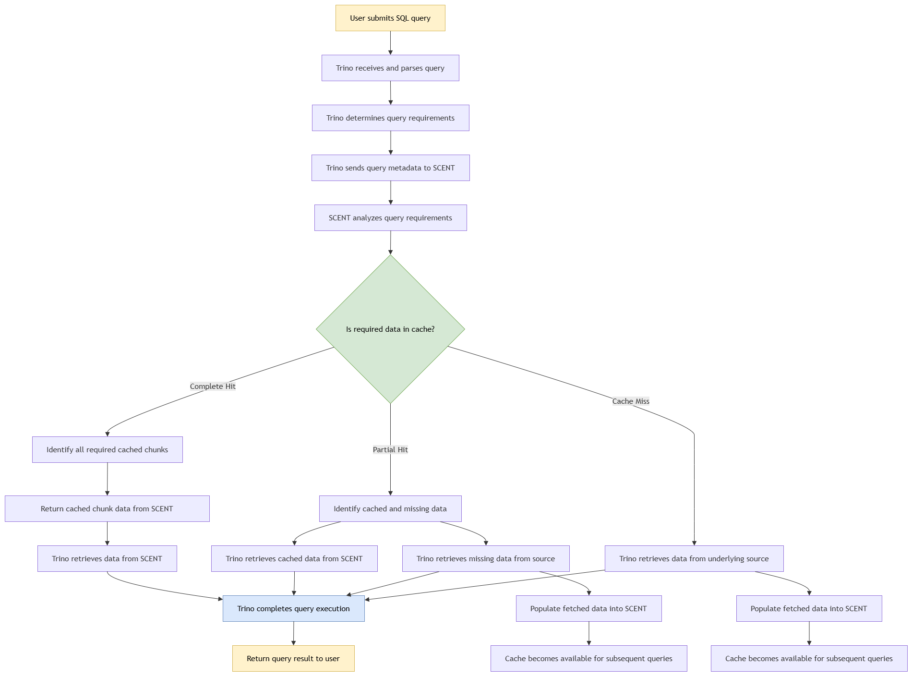

# SCENT - Semantic Cache for Engine Trino

## Overview

**SCENT** is a semantic caching layer that enables [Trino](https://trino.io/) to reuse previously retrieved data across federated queries.

---

## Table of Contents

- [1. The Core Problem](#1-the-core-problem)
- [2. The Product Concept](#2-the-product-concept)
- [3. Core Components / Flow](#3-core-components--flow)
- [4. Scope Boundaries](#4-scope-boundaries)
  - [In-Scope](#in-scope)
  - [Out-of-Scope](#out-of-scope)

---

## The Core Problem

**Pain point:** Trino enables users to query data across multiple remote and heterogeneous data sources such as Oracle, PostgreSQL, and BigQuery. As different queries access overlapping datasets, the same underlying data can be repeatedly retrieved from source systems. This results in:

- Higher query latency
- Increased network traffic
- Repeated computation
- Additional load on source databases

**Intended users:** Teams running federated analytics on Trino — data engineers and analysts issuing repeated or overlapping queries against the same remote sources, and platform teams looking to reduce source-system load and query costs.

---

## The Product Concept

SCENT is a semantic caching layer that enables Trino to reuse previously retrieved data across federated queries. It identifies and serves reusable data segments from the cache, allowing different queries with varying filters, projections, and joins to share cached data instead of repeatedly fetching the same data from remote sources.

**Primary value proposition:** SCENT cuts down redundant data retrieval across Trino queries, which lowers query latency, reduces network traffic and load on source systems, and improves scalability as the number of users and queries grows.

---

## Core Components / Flow

<!-- Add the architecture diagram here -->

---

# Scope Boundaries

## In-Scope

The MVP must support the following minimal flow:

- Trino receives and parses the SQL query and determines the data and query requirements needed for execution.

- Trino sends the required query metadata to SCENT, including:
   - Catalog / data source
   - Database / schema
   - SQL predicates and partition filters

- SCENT analyzes the query requirements and determines whether the required data is available in the cache.

- Complete cache-hit scenario: SCENT identifies the required cached chunks and returns the data to Trino.

- Partial cache-hit scenario: If only a subset of the required data is available in the cache, SCENT identifies the cached chunks and the missing data. Trino retrieves the cached data from SCENT and retrieves the missing data from the underlying data source. 

- Cache-miss scenario: If the required data is not available in the cache, Trino retrieves the data from the underlying data source.

- Cache population: Data retrieved from the underlying data source during a partial cache-hit or cache-miss is simultaneously written to SCENT, making it available for reuse by subsequent queries.

- Trino combines the data retrieved from SCENT and the underlying data source, where applicable, and completes query execution using its existing execution engine.

- End-to-end demonstration: A repeated query should be able to retrieve its required data from SCENT instead of accessing the underlying data source.
---

### Out-of-Scope

| Feature | Description |
|---|---|
| **Deduplicated chunk storage** | Optimize chunk storage to identify and avoid storing duplicate chunks across queries or cache entries. |
| **Streaming data transfer** | Investigate streaming cached data from SCENT to Trino instead of transferring complete chunks. |
| **Role-based access control** | Introduce role-based permissions to control who can access data. |
| **Partition-filter enforcement** | Restrict or reject queries that do not provide appropriate partition filters to prevent inefficient or excessive data caching. |
| **Configurable caching policies** | Allow users to configure which tables should be cached and define the appropriate partition-filter grain for each table. |
| **Cache observability and analytics** | Provide dashboards and metrics for cache hit rate, miss rate, storage utilization, frequently accessed chunks, and query performance improvements. |

---