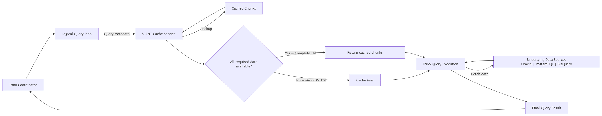

# SCENT - Semantic Cache for Engine Trino

---

## The Core Problem

Trino enables users to query data across multiple remote and heterogeneous data sources such as Oracle, PostgreSQL, and BigQuery. As different queries access overlapping datasets, the same underlying data can be repeatedly retrieved from source systems. This results in higher query latency, increased network traffic, repeated computation, and additional load on source databases.

The problem becomes more significant as the number of users and queries grow, because the same data may be retrieved multiple times even when it has already been fetched by another query.

---

## The Product Concept

SCENT is a semantic caching layer that enables Trino to reuse previously retrieved data across federated queries. It identifies and serves reusable data segments from the cache, allowing different queries with varying filters, projections, and joins to share cached data instead of repeatedly fetching the same data from remote sources.

---

## Primary Value Proposition

SCENT eliminates redundant retrieval of reusable data across Trino queries by allowing previously fetched data to be shared across different query patterns.

This reduces repeated reads from remote data sources, network traffic, and source-system load, while improving query latency, resource utilization, and scalability as query volume increases.

---

## Core Components / Flow

<!-- Add the architecture diagram here -->

---

# Scope Boundaries

## In-Scope (Must Have)

The MVP must support the following minimal flow:

1. Trino receives and parses the SQL query and generates the logical query plan.
2. Trino sends the required query metadata to SCENT, including:
    - Logical query plan
    - Catalog / data source
    - Database / schema
    - Partition filters
3. SCENT analyzes the query requirements and determines whether the required data is available in the cache.
4. **Complete cache-hit scenario:** SCENT identifies the required cached chunks and returns their locations/metadata to Trino.
5. **Cache-miss scenario:** If the required data is not completely available in the cache, Trino falls back to the underlying data source.
6. Trino retrieves the data and completes query execution using its existing execution engine.
7. **End-to-end demonstration:** A repeated query should be able to retrieve its required data from SCENT instead of accessing the underlying data source.

---

## Out-of-Scope (Not now)

- **Deduplicated chunk storage:** Optimize chunk storage to identify and avoid storing duplicate chunks across queries or cache entries.
- **Streaming data transfer:** Investigate streaming cached data from SCENT to Trino instead of transferring complete chunks.
- **Role-based access control:** Introduce role-based permissions to control who can access data.
- **Partition-filter enforcement:** Restrict or reject queries that do not provide appropriate partition filters to prevent inefficient or excessive data caching.
- **Configurable caching policies:** Allow users to configure which tables should be cached and define the appropriate partition-filter grain for each table.
- **Intelligent cache eviction:** Implement advanced eviction policies based on access frequency, recency, storage consumption, or query patterns.
- **Cache observability and analytics:** Provide dashboards and metrics for cache hit rate, miss rate, storage utilization, frequently accessed chunks, and query performance improvements.

---