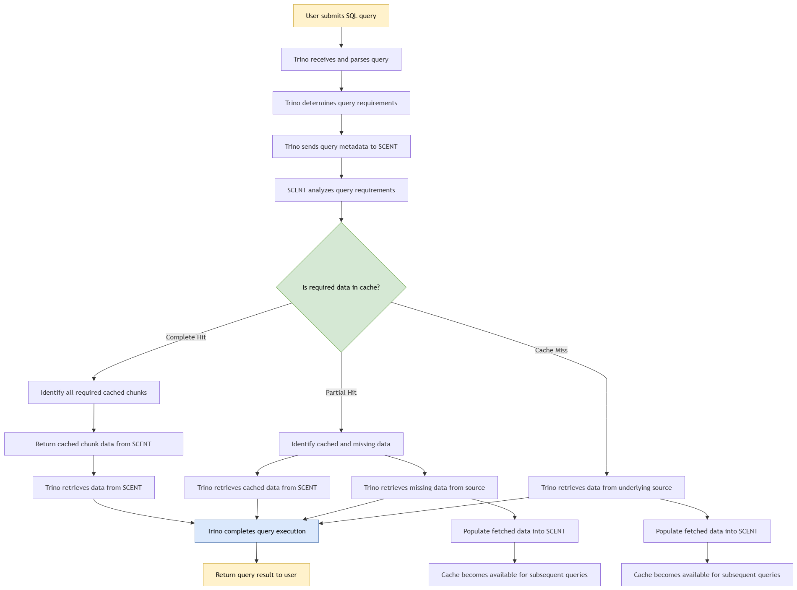

# SCENT - Semantic Cache for Engine Trino

## Overview

**SCENT** is a semantic caching layer that enables [Trino](https://trino.io/) to reuse previously retrieved data across federated queries.

---

## Table of Contents

- [1. The Core Problem](#the-core-problem)
- [2. The Product Concept](#the-product-concept)
- [3. Core Components / Flow](#core-components--flow)
- [4. Scope Boundaries](#scope-boundaries)
  - [In-Scope](#in-scope)
  - [Out-of-Scope](#out-of-scope)
- [5. Deployment](#deployment)
  - [Build](#build)
  - [Install on the cluster](#install-on-the-cluster)
  - [Catalog configuration](#catalog-configuration)
  - [Version lock](#version-lock)

---

## The Core Problem

**Pain point:** Trino enables users to query data across multiple remote and heterogeneous data sources such as Oracle, PostgreSQL, and BigQuery. As different queries access overlapping datasets, the same underlying data can be repeatedly retrieved from source systems. This results in:

- Higher query latency
- Increased network traffic
- Repeated computation
- Additional load on source databases

**Intended users:** Teams running federated analytics on Trino — data engineers and analysts issuing repeated or overlapping queries against the same remote sources, and platform teams looking to reduce source-system load and query costs.

---

## The Product Concept

SCENT is a semantic caching layer that enables Trino to reuse previously retrieved data across federated queries. It identifies and serves reusable data segments from the cache, allowing different queries with varying filters, projections, and joins to share cached data instead of repeatedly fetching the same data from remote sources.

**Primary value proposition:** SCENT cuts down redundant data retrieval across Trino queries, which lowers query latency, reduces network traffic and load on source systems, and improves scalability as the number of users and queries grows.

---

## Core Components / Flow

<!-- Add the architecture diagram here -->

---

# Scope Boundaries

## In-Scope

The MVP must support the following minimal flow:

- Trino receives and parses the SQL query and determines the data and query requirements needed for execution.

- Trino sends the required query metadata to SCENT, including:
   - Catalog / data source
   - Database / schema
   - SQL predicates and partition filters

- SCENT analyzes the query requirements and determines whether the required data is available in the cache.

- Complete cache-hit scenario: SCENT identifies the required cached chunks and returns the data to Trino.

- Partial cache-hit scenario: If only a subset of the required data is available in the cache, SCENT identifies the cached chunks and the missing data. Trino retrieves the cached data from SCENT and retrieves the missing data from the underlying data source. 

- Cache-miss scenario: If the required data is not available in the cache, Trino retrieves the data from the underlying data source.

- Cache population: Data retrieved from the underlying data source during a partial cache-hit or cache-miss is simultaneously written to SCENT, making it available for reuse by subsequent queries.

- Trino combines the data retrieved from SCENT and the underlying data source, where applicable, and completes query execution using its existing execution engine.

- End-to-end demonstration: A repeated query should be able to retrieve its required data from SCENT instead of accessing the underlying data source.
---

### Out-of-Scope

| Feature | Description |
|---|---|
| **Deduplicated chunk storage** | Optimize chunk storage to identify and avoid storing duplicate chunks across queries or cache entries. |
| **Streaming data transfer** | Investigate streaming cached data from SCENT to Trino instead of transferring complete chunks. |
| **Role-based access control** | Introduce role-based permissions to control who can access data. |
| **Partition-filter enforcement** | Restrict or reject queries that do not provide appropriate partition filters to prevent inefficient or excessive data caching. |
| **Configurable caching policies** | Allow users to configure which tables should be cached and define the appropriate partition-filter grain for each table. |
| **Cache observability and analytics** | Provide dashboards and metrics for cache hit rate, miss rate, storage utilization, frequently accessed chunks, and query performance improvements. |

---

## Deployment

### Build

```bash
# Requires JDK 25 (Trino 483 is built for it)
JAVA_HOME=/path/to/jdk-25 mvn clean package
```

The build depends only on `trino-spi` (plus `slf4j-api` for logging), both published for every Trino release. The delegate connectors (PostgreSQL, Oracle, BigQuery) are **not** build dependencies — they are resolved reflectively at runtime, and their jars come from the cluster (next step).

### Install on the cluster

Trino gives every plugin directory its own classloader, so a separately installed delegate plugin is **not** visible to SCENT. The delegate's jars must be copied into SCENT's own plugin directory — they are already on the cluster, shipped with the Trino distribution, so they are version-matched by construction.

Create the plugin directory and copy in the delegate jars you intend to use:

```bash
PLUGIN_DIR=/usr/lib/trino/plugin/scent
DELEGATES="postgresql"   # edit to the delegates your catalogs actually use
mkdir -p "$PLUGIN_DIR"

cp target/scent-trino-plugin-0.1.0-SNAPSHOT.jar "$PLUGIN_DIR/"
cp target/scent-trino-plugin-0.1.0-SNAPSHOT-services.jar "$PLUGIN_DIR/"

# SCENT's runtime dependencies. A plugin classloader sees only the JDK and the SPI
# packages from the server, so every other dependency must be inside the plugin
# directory: slf4j-api (used by the @Slf4j-generated code) and its jdk14 provider,
# which routes plugin logs into Trino's log. lombok is compile-time only.
mvn -q dependency:copy-dependencies -DincludeScope=runtime -DexcludeArtifactIds=lombok \
    -DoutputDirectory="$PLUGIN_DIR"

for d in $DELEGATES; do
    find "/usr/lib/trino/plugin/$d" -name '*.jar' ! -name '*-services.jar' \
        -exec cp -n {} "$PLUGIN_DIR/" \;
done
```

The layout ends up as:

```text
/usr/lib/trino/plugin/scent/
|-- scent-trino-plugin-0.1.0-SNAPSHOT.jar
|-- scent-trino-plugin-0.1.0-SNAPSHOT-services.jar   # registers cache-wrapper
|-- slf4j-api-2.0.18.jar                             # SCENT's runtime deps (dependency:copy-dependencies)
|-- slf4j-jdk14-2.0.18.jar                           # SLF4J provider: routes plugin logs to Trino's log
|-- io.trino_trino-postgresql-483.jar                # copied from the cluster's own plugin dir
|-- io.trino_trino-oracle-483.jar
`-- <their transitive dependencies>
```

Two rules:

- **Exclude the delegate `-services.jar` files.** Including one would register the delegate as a top-level connector and collide with its own plugin directory at startup (Trino rejects duplicate connector registration). The `! -name '*-services.jar'` in the command above handles this.
- **Install SCENT in exactly one plugin directory.** Do not copy the SCENT jar into a delegate's plugin directory (`/plugin/postgresql/`, etc.) — each directory would register `cache-wrapper`, and duplicate connector registration is fatal.

**Why copying the delegate main jars does not double-register the delegate.** Trino registers a connector only when it finds a `META-INF/services/io.trino.spi.Plugin` descriptor on a plugin directory's classloader (`ServiceLoader` in `PluginManager`); a second registration of the same connector name fails startup with `Connector 'X' is already registered`. Trino's own packaging (`trino-maven-plugin`) puts those descriptors in the `-services.jar` and keeps the main jar free of them, so the copied main jars only put the delegate's *classes* on SCENT's classloader — `oracle` is still registered exactly once, from its own plugin directory.

This holds for every connector shipped with the Trino distribution. A third-party delegate jar that bundles its own descriptor would register the connector twice and kill startup, so verify once per delegate:

```bash
# Expect NO output: the delegate's main jar must not contain a Plugin descriptor
unzip -l /usr/lib/trino/plugin/oracle/io.trino_trino-oracle-483.jar \
    | grep 'META-INF/services/io.trino.spi.Plugin'
```

Delegate plugins elsewhere on the cluster are unaffected. A delegate whose jars were not copied in only fails if a catalog actually references it; other catalogs are unaffected.

### Catalog configuration

```properties
# /etc/trino/catalog/cached_pg.properties
connector.name=cache-wrapper
delegate.connector.name=postgresql

# Upstream connector credentials (passed through to the delegate)
connection-url=jdbc:postgresql://postgres.production.internal:5432/analytics
connection-user=trino_readonly
connection-password=secure_password
```

### Version lock

SCENT is **version-locked** to the Trino release it was built against — true of any Trino plugin, since the SPI is not stable across releases. `CachingConnectorFactory` verifies this at catalog creation via `ConnectorContext.getSpiVersion()` and fails fast with an actionable message instead of a query-time `NoSuchMethodError`.

Upgrading Trino therefore means: bump `<trino.version>` in `pom.xml`, rebuild, and redeploy the two SCENT jars into the plugin directory. The delegate jars already on the cluster are version-matched by construction.

---